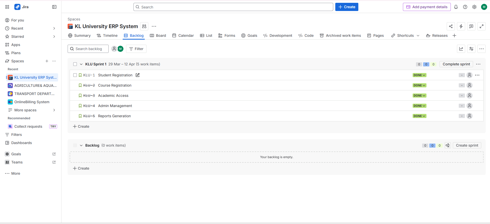
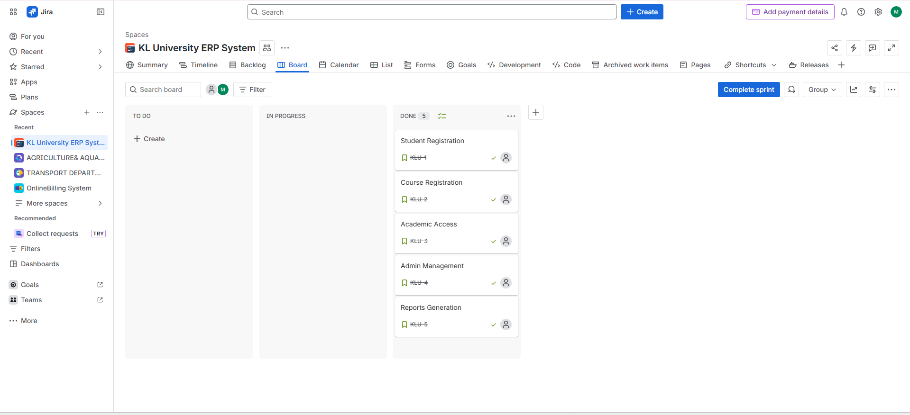
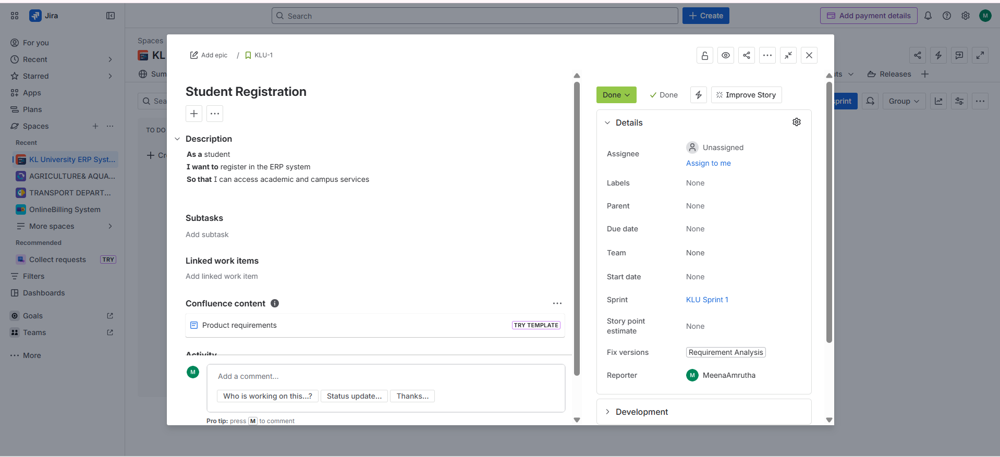
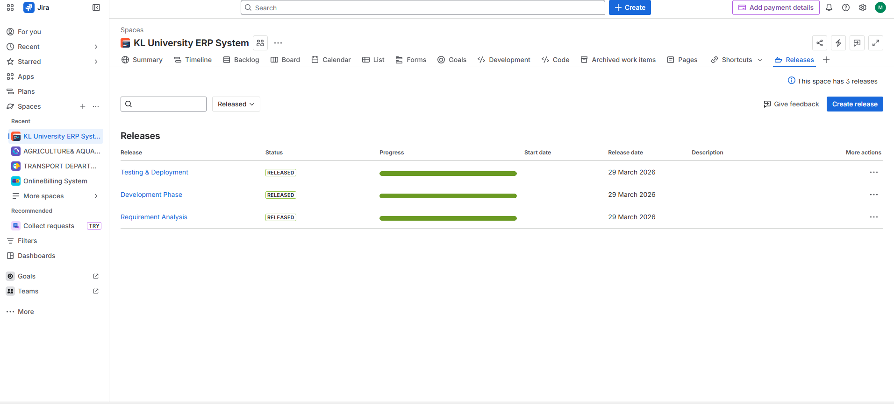

# klu-erp-scrum-project
KL University ERP system using Scrum (User Stories, Issues, Milestones in Jira)

**KL University ERP System (Scrum Project)**
**Project Overview**
This project demonstrates the KL University ERP system managed using Scrum methodology using Jira.

**User Roles**
* Administrator
* Officer
* Faculty
* Student

**User Stories**
1. Student Registration
2. Course Registration
3. Academic Access
4. Admin Management
5. Report Generation

**Issues**

* Login Authentication Error
* Course Conflict Issue
* Library/Hostel Data Delay

**Milestones (Versions)**
* Requirement Analysis
* Development Phase
* Testing & Deployment

**Screenshots**
**Backlog**

**Board**

**Stories**

**Milestones**

